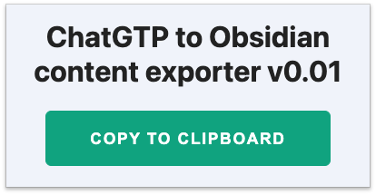

# ChatGPT Markdown Export to Obsidian
  
It's a Chrome extension which allows to export chat from ChatGPT to Obsidian. It's generate Markdown specifically to Obsidian and copy to clipboard

## Features

- Export to [Obsidian](https://obsidian.md/) Markdown format (use Obsidian [callouts](https://help.obsidian.md/Editing+and+formatting/Callouts) feature)

---

This project was bootstrapped with [Chrome Extension CLI](https://github.com/dutiyesh/chrome-extension-cli)

